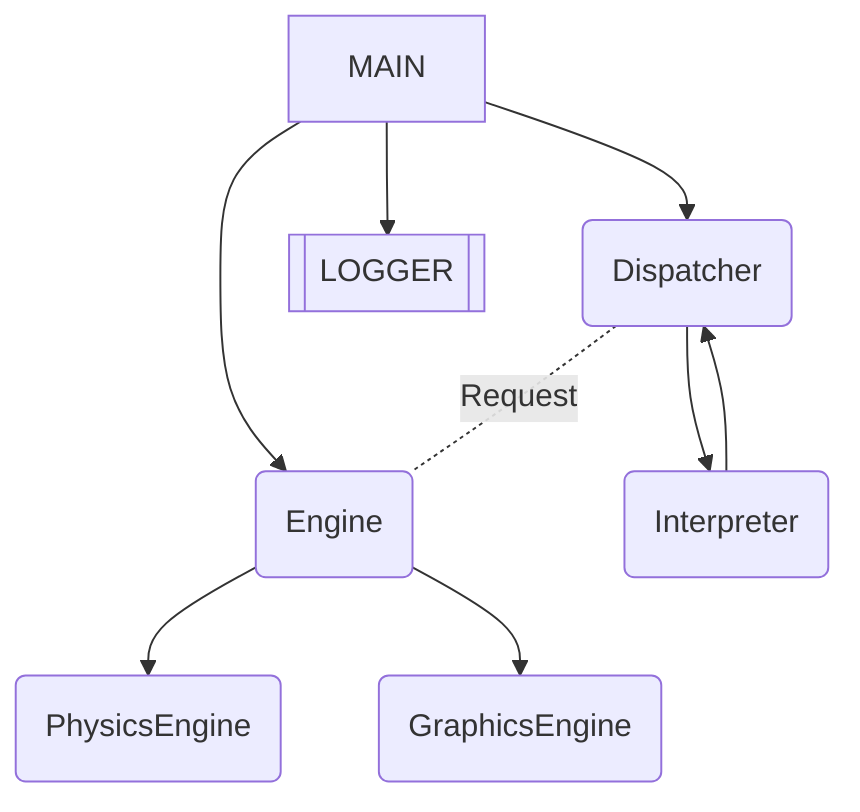
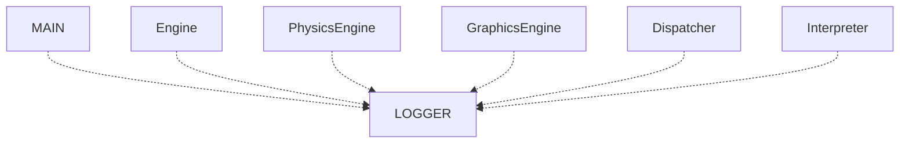

# Architecture
In this file I will describe the architecture of the project, contents of each file etc.
## List of contents
1. [Libraries](#libraries)
2. [High-level Overview](#high-level-overview)
3. [Threads](#Threads)
4. [Core systems](#core-system)
	1. [Engine](#engine)
	2. [PhysicsEngine](#physicsengine)
	3. [GraphicsEngine](#graphicsengine)
	4. [Dispatcher](#dispatcher)
	5. [Interpreter](#interpreter)
	2. [Logger](#logger)
5. [Data flow](#data-flow)
6. [Planned extensions](#planned-extensions)
## 1. Libraries
For graphics I use OpenGL. It contains GLFW (API for creating windows, context etc), GLEW (for extensions) and GLM (for math). 
Also I use GLM math in physics because it's convinient.
## 2. High-level Overview
First, when you run a program, the main thread starts the LOGGER thread, the Engine thread and the Dispatcher thread. 
Then, if Dispatcher called the exit method, than main thread will stop all the processes and close the program.
The Engine manages graphics and physics, the Dispatcher manages inputs from user and Logger manages output.
The Engine has subclasses: GraphicsEngine and PhysicsEngine. Dispatcher also has a subclass - Interpreter. It parses user input and execute the commands.

Also each of the classes can log messages via their own Logger instance, that sends log message to the common LOGGER thread.

## 3. Threads
### 3.1 MAIN Thread
Basically the MAIN thread only starts the other processes, then it awaits a closure of the program.
### 3.2 LOGGER Thread
The LOGGER Thread accepts log requests from other instances and prints it to the console and to the file in the logs folder.
### 3.3 Engine Thread
The Engine thread updates PhysicsEngine and GraphicsEngine every tick. 'dt' value that is necessary to update PhysicsEngine (a time step) is counted as time difference between two ticks.
### 3.4 Dispatcher Thread
The Dispatcher Thread listens to user input and send it to Interpreter. In that thread Interpreter parse input and run command in seperated thread.
### 3.5 Interpreter Thread
Actually, there is not one Interpreter thread. Each command Interpreter creates a seperated thread, and as the task is completed this thread is joined to Dispatcher thread.
## 4. Core systems
There I will describe what each system does and how the interacts.
### 4.1 Engine
The Engine handles interaction with PhysicsEngine and GraphicsEngine, and also interacts with Dispatcher via pointers and system of requests.
Each iteration of the loop it computes dt as the time difference between this and the previous tick and then updates PhysicsEngine and GraphicsEngine
### 4.2 PhysicsEngine
This module handles all the physics. The PhysicsEngine class manages creation of new bodies, computing possible collisions and updates each body.
The class Body is a basic class containing all the properties each body has sych as id, mass, velocity and acceleration. This properties are protected. Also this body cannot be created, it can only be inheritated.
The class RigidBody inheritated the Body class and adds accumulators of force and torque. Also now there are methods to apply forces or impulses (in case of collision).
### 4.3 GraphicsEngine
This module manages all the graphics via OpenGL. Right now it is not implemented yet.
### 4.4 Dispatcher
The Dispatcher send input from user to Interpreter to parse it.
### 4.5 Interpreter
When the Interpreter gets the input from user, it divides the string to command (the first word) and arguments, and then tries to execute the command with this name and give the arguments.
If command found, then it will parse the arguments. Each command parse it itself, it should be written in the body of function of command.
The Interpreter stores the list of the commands.
The Command class contains its name, description and function accepting a string as args. Commands are created and added in Interpreter.init_commands() using the following format:
```
Command [command_name] = Command(“[command_name]”);
[command_name].add_description(“This is displayed when /“help/” is called”);
[command_name].set_callback([this](std::string args) {
    [Body of function. Here can be added parsing of 'args' string and the functionality of the function]
};)
```
### 4.6 Logger
The Logger class is created in each module. It has a name of the module and has 4 types of logging.

	1. info(text) - prints information in the following format: [<current_time>][<logger_name>] text
	2. warn(text) - prints a warn like info(text), but the message is yellow
	3. error(text) - prints a warn like info(text), but the message is red
	4. raw(text) - doesn't format a text at all and prints it exactly as given.
After calling this function, the text will get to the queue. After the queue it will be printed to console ad saved to the "latest_log.txt" file and to the file with current date and number of log.
## 5. Data flow
After getting input from user by Dispatcher, it is sent to Interpreter, than Interpreter executes the command and sends a request to Engine if necessearly.
Then, Engine executes the request and updates the simulation, and you can see changes on the screen. 
For example, command 'create 0 0 1' will be sent to Interpreter, than Interpreter will send a CreateBodyRequest to Engine, and Engine will add the body in pos [0, 0] and mass 1 to the simulation.
## 6. Planned extensions
Right now there is a lot of stuff I need to add, for example graphics. After that I'd like to add other types of forces and objects, like springs.
	
	
	