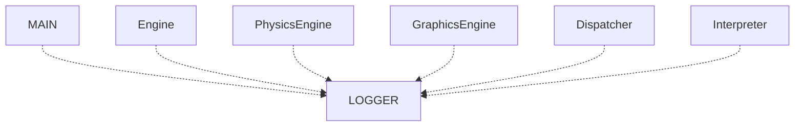

# Architecture
This file describesw the project's architecture and the contents of each component.
## List of contents
1. [Libraries](#1-libraries)
2. [High-level Overview](#2-high-level-overview)
3. [Threads](#3-threads)
4. [Core systems](#4-core-systems)
	1. [Engine](#engine)
	2. [PhysicsEngine](#physicsengine)
	3. [GraphicsEngine](#graphicsengine)
	4. [Dispatcher](#dispatcher)
	5. [Interpreter](#interpreter)
	2. [Logger](#logger)
5. [Data flow](#5-data-flow)
6. [Planned extensions](#6-planned-extensions)
## 1. Libraries
For graphics, the project uses **OpenGL**, along with **GLFW** (for window and context creation), **GLEW** (for handling OpenGL extensions), and **GLM** (for mathematics). I also use **GLM** math  for physics calculations because it's convinient.
## 2. High-level Overview
First, when you run a program, the main thread starts the `LOGGER` thread, the `Engine` thread and the `Dispatcher` thread. 
If the `Dispatcher` calls the exit method, the main thread will stop all the processes and close the program.
The `Engine` manages graphics and physics, the `Dispatcher` manages inputs from user and `Logger` manages output.
The `Engine` has subclasses: `GraphicsEngine` and `PhysicsEngine`. `Dispatcher` also has a subclass - `Interpreter`. It parses user input and execute the commands.


Also each of the classes can log messages via their own `Logger` instance, that sends log message to the common `LOGGER` thread.

## 3. Threads
### MAIN Thread
Basically the `MAIN` thread only starts the other processes, then it awaits a closure of the program.
### LOGGER Thread
The `LOGGER` Thread accepts log requests from other instances and prints it to the console and to the file in the logs folder.
### Engine Thread
The `Engine` thread updates `PhysicsEngine` and `GraphicsEngine` every tick. 'dt' value that is necessary to update `PhysicsEngine` (a time step) is counted as time difference between two ticks.
### Dispatcher Thread
The `Dispatcher` Thread listens to user input and send it to `Interpreter`. In that thread `Interpreter` parse input and run command in seperated thread.
### Interpreter Thread
Actually, there is not one `Interpreter` thread. Each command `Interpreter` creates a seperated thread, and as the task is completed this thread is joined to `Dispatcher` thread.
## 4. Core systems
There I will describe what each system does and how the interacts.
### Engine
The `Engine` handles interaction with `PhysicsEngine` and `GraphicsEngine`, and also interacts with `Dispatcher` via pointers and system of requests.
Each iteration computes `dt`, the time difference between the current and previous tick. Then it updates `PhysicsEngine` and `GraphicsEngine`
### PhysicsEngine
This module handles all the physics. The `PhysicsEngine` class manages creation of new bodies, computing possible collisions and updates each body.
The `Body` class defines the common properties shared by all bodies, such as `id`, mass, velocity, and acceleration. 
These properties are protected. The `Body` class cannot be instantiated directly — it must be inherited.
The class `RigidBody` inheritated the `Body` class and adds accumulators of force and torque. Also now there are methods to apply forces or impulses (in case of collision).
More about `PhysicsEngine` you can read [here](physics-engine.md).
### GraphicsEngine
This module manages all the graphics via `OpenGL`. Right now it is not implemented yet.
### Dispatcher
The `Dispatcher` sends user input from user to the `Interpreter` for parsing.
### Interpreter
When the `Interpreter` gets the input from user, it divides the string to command (the first word) and arguments, and then tries to execute the command with this name and give the arguments.
If the command is found, it will parse its arguments. Each command parse it itself, it should be written in the body of function of command.
The `Interpreter` stores the list of the commands.
The `Command` class contains its name, description and function accepting a string as args. Commands are created and added in `Interpreter.init_commands()` using the following format:
```
Command [command_name] = Command(“[command_name]”);
[command_name].add_description(“This is displayed when /“help/” is called”);
[command_name].set_callback([this](std::string args) {
    [Body of function. Here can be added parsing of 'args' string and the functionality of the function]
};)
```
### Logger
The `Logger` class is created in each module. It has a name of the module and has 4 types of formatting message.

- info
- warn
- error
- raw

After calling one of these functions, the message is added to the logging queue. Messages are printed to the console and written both to `latest_log.txt` and to a dated log file.
More about logger you can read [here](logger.md).
## 5. Data flow
After getting input from user by `Dispatcher`, it is sent to `Interpreter`, than `Interpreter` executes the command and sends a request to `Engine` if necessearly.
Then, `Engine` executes the request and updates the simulation, and you can see changes on the screen.  
For example, command `'create 0 0 1'` will be sent to `Interpreter`, than `Interpreter` will send a `CreateBodyRequest` to `Engine`, and `Engine` will create the `Body` in pos [0, 0] and mass 1 to the simulation.
## 6. Planned extensions
Right now there is a lot of stuff I need to add, for example graphics. After that I'd like to add other types of forces and objects, like springs. 
	
	
	
